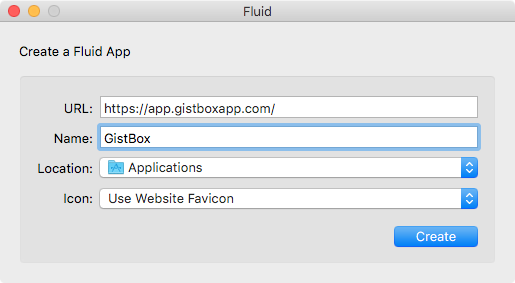
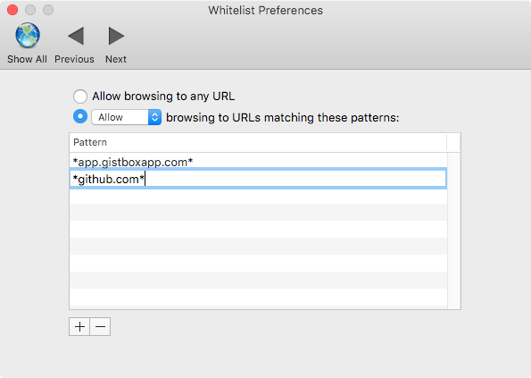

Using [GistBox](https://gistboxapp.com/) Natively on MacOSX
===========================================================

So you've discovered [Gists](https://help.github.com/articles/about-gists/) for organising and sharing (pseudo) code snippets, *and* you've discovered the beautiful [GistBox](https://gistboxapp.com/) as an interface for your gists. You feel like you just want it as a standalone app though, well...

## 1. Download and install [Fluid](http://fluidapp.com/)
Download [fluid](http://fluidapp.com/) to create a Site Specific Browser (SSB) (The free version is fine, but the paid version lets you anchor it in your menubar!). Fluid is an application that makes any web-app you commonly use into a standalone app. For those inclined you can install fluid via [Homebrew cask](https://caskroom.github.io/) with `brew cask install fluid`

Once you've installed fluid open the application and enter the following information to set up GistBox and click create.

  - **URL:** app.gistboxapp.com
  - **Name:** GistBox

This should create an SSB specifically for GistBox and place it in /Applications/. Launch the application and you should load the GistBox login page. Since GistBox is essentially a interface for your [gists](https://gist.github.com) it uses you github credentials to log you in. If you simply sign in with github you'll open [github.com](https://github.com) in your default browser and never sign in. 

To make GitBox work with Fluid you have to whitelist github.com links in `Preferences > Whitelist`, so that the initial signup can happen. After that it works fine. Make sure you use \*'s to whitelist *all* github links generally.

Once you've done that you can click ‘sign in with github’ and you should sign into your GistBox account.

## Gist away!

Guide by [tmgriffiths](https://twitter.com/tmgriffiths).